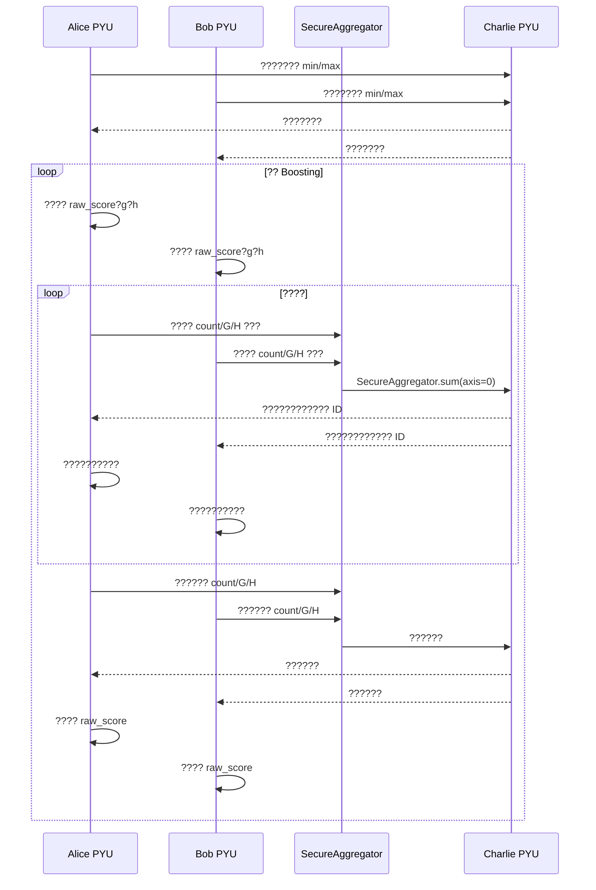

# ?????????????????

## 1. ????

| ?? | ???? | ???? |
|---|---|---|
| Alice | ??????????????????? | ?????g/h???????????? |
| Bob | ??????????????????? | ? Alice ?? |
| Charlie | ???????? | ??????????????????????????? |

Alice ? Bob ??????????????? dtype ???`sample_id` ?????
?????????????????????????????????????

## 2. ??????



## 3. ?????????

? `depth` ????????????

```text
root = 0
left = 2 * node_id + 1
right = 2 * node_id + 2
```

???????

```text
(2**depth, feature_count, max_bin, 3)
```

??????????????????? Alice/Bob ??????????????
?????????? `[count, sum_grad, sum_hess]`????? `float64`?

## 4. SecureAggregator ?????

?????????

```python
aggregator.sum([alice_histogram, bob_histogram], axis=0)
```

?? SecretFlow `1.13.0b0` ???????????????????
`np.sum(masked_data, axis=axis)`?`axis=0` ????????????????
`axis=None` ??????????????????????????????
`numpy.uint64` ??????`tests/test_secure_aggregation.py` ??????????
????????? AST ???????????????? `axis=0`?

## 5. ??????

| ?? | Alice | Bob | Charlie | ?? |
|---|---:|---:|---:|---|
| Alice ????/?? | ? | ? | ? | ?? Alice PYU |
| Bob ????/?? | ? | ? | ? | ?? Bob PYU |
| ??? raw_score/g/h | ?? | ?? | ? | ??????? |
| ??????? min/max | ?? | ?? | ? | ?????????? |
| ????? | ? | ? | ? | ?????? |
| ?? count/G/H ??? | ? | ? | ? | ????????? |
| ???????????? | ? | ? | ? | ????? |
| ???? G/H | ? | ? | ? | ??????? |
| ??????? | ? | ? | ? | ???????? |

## 6. ????

`privacy_audit.py` ??????

1. ?? `client.py`?`server.py` ? AST?????????????? `reveal`?
2. ?????????????????????????? Charlie ????????
   ???

????????????????????????????????????
`outputs/metrics/breast_cancer_privacy_audit.json`?

## 7. ???????

?????????????Charlie ???? Alice/Bob ?????????
min/max???????????????????????????????????
??????????????????????????????????????
????????????????????
