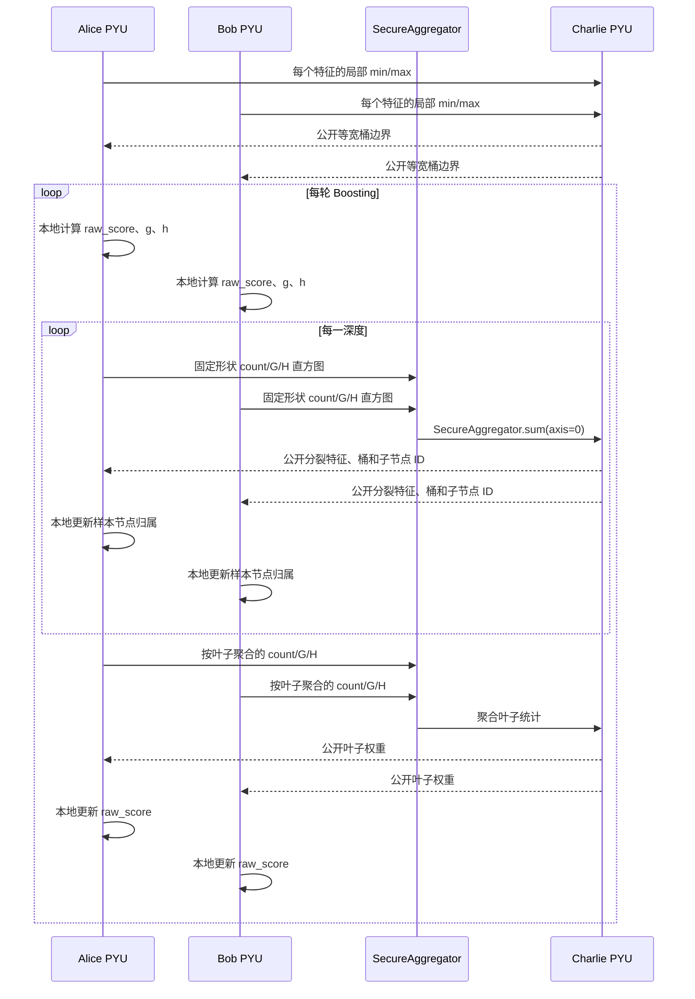

# 水平联邦训练协议、数据流与隐私边界

## 1. 三方角色

| 角色 | 持有内容 | 主要职责 |
|---|---|---|
| Alice | 自己的样本行、全部同构特征、自己的标签 | 本地分桶、g/h、直方图、路由、预测更新 |
| Bob | 自己的样本行、全部同构特征、自己的标签 | 与 Alice 相同 |
| Charlie | 不持有原始样本表 | 合并桶边界统计、接收安全聚合结果、选择分裂、计算叶权重 |

Alice 与 Bob 是“同列不同人”：列名、顺序和 dtype 一致，`sample_id` 互不重叠。
如果特征结构不同，同一个直方图索引在两方将代表不同含义，聚合结果无法解释。

## 2. 完整训练序列



## 3. 固定形状与节点编号

第 `depth` 层使用完整堆式节点编号：

```text
root = 0
left = 2 * node_id + 1
right = 2 * node_id + 2
```

客户端构造形状

```text
(2**depth, feature_count, max_bin, 3)
```

的张量。提前停止节点对应位置填零，避免 Alice/Bob 因本地数据不同而产生不同张量
形状。最后一维固定为 `[count, sum_grad, sum_hess]`，全部采用 `float64`。

## 4. SecureAggregator 兼容性约束

代码必须显式调用：

```python
aggregator.sum([alice_histogram, bob_histogram], axis=0)
```

当前 SecretFlow `1.13.0b0` 的实现会先把各参与方数组组成序列再执行
`np.sum(masked_data, axis=axis)`。`axis=0` 对参与方维求和并保留原张量形状；
`axis=None` 会把参与方维和直方图所有维一起压成标量，随后浮点定点解码遇到
`numpy.uint64` 标量而失败。`tests/test_secure_aggregation.py` 同时验证真实聚合精度
和此回归约束，并用 AST 检查训练器中的聚合调用均显式传入 `axis=0`。

## 5. 可见信息矩阵

| 信息 | Alice | Bob | Charlie | 说明 |
|---|---:|---:|---:|---|
| Alice 原始特征/标签 | 是 | 否 | 否 | 只在 Alice PYU |
| Bob 原始特征/标签 | 否 | 是 | 否 | 只在 Bob PYU |
| 逐样本 raw_score/g/h | 本地 | 本地 | 否 | 不跨客户端发送 |
| 各方逐特征局部 min/max | 自己 | 自己 | 是 | 教学版接受的统计泄露 |
| 全局桶边界 | 是 | 是 | 是 | 共享模型信息 |
| 聚合 count/G/H 直方图 | 否 | 否 | 是 | 看不到各方明文分量 |
| 分裂特征、桶、阈值、增益 | 是 | 是 | 是 | 公开树结构 |
| 聚合叶子 G/H | 否 | 否 | 是 | 用于计算叶权重 |
| 最终完整树模型 | 是 | 是 | 是 | 各客户端预测所需 |

## 6. 隐私审计

`privacy_audit.py` 做两类检查：

1. 解析 `client.py`、`server.py` 的 AST，禁止在这两个角色模块中调用 `reveal`；
2. 训练期间只记录消息语义、发送者、接收者和张量形状，对 Charlie 的输入执行白名单
   检查。

日志不记录原始特征、标签、逐样本预测、逐样本梯度或代理路径。正式报告位于
`outputs/metrics/breast_cancer_privacy_audit.json`。

## 7. 明确的安全限制

本项目不是生产级隐私协议。Charlie 可以看到 Alice/Bob 各自每个特征的局部
min/max，这可能暴露范围和异常值信息；等宽分桶也没有使用安全分位数、差分隐私或
恶意参与方防护。静态白名单审计能够发现明显数据流违规，但不能证明密码学安全、
抗串谋、抗侧信道或日志系统的全局安全性。
